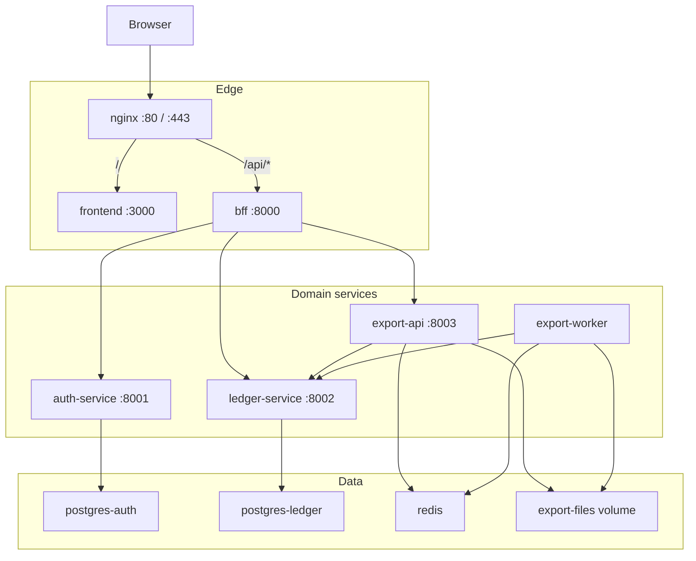
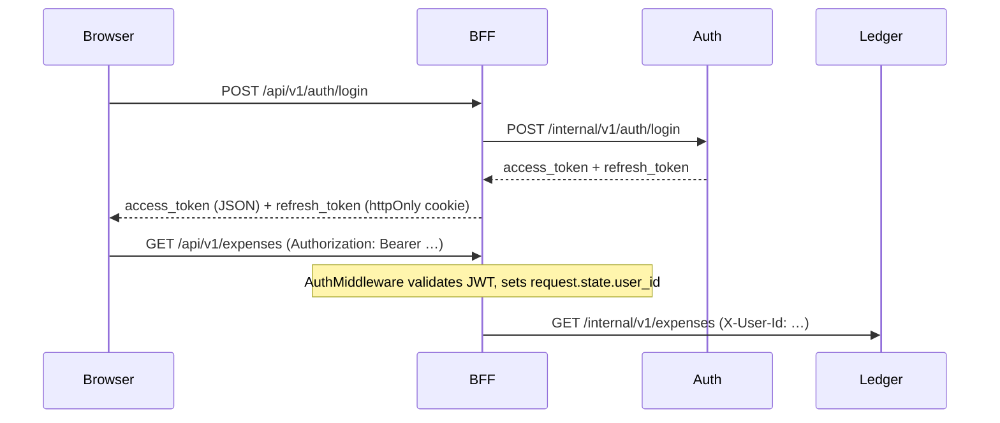
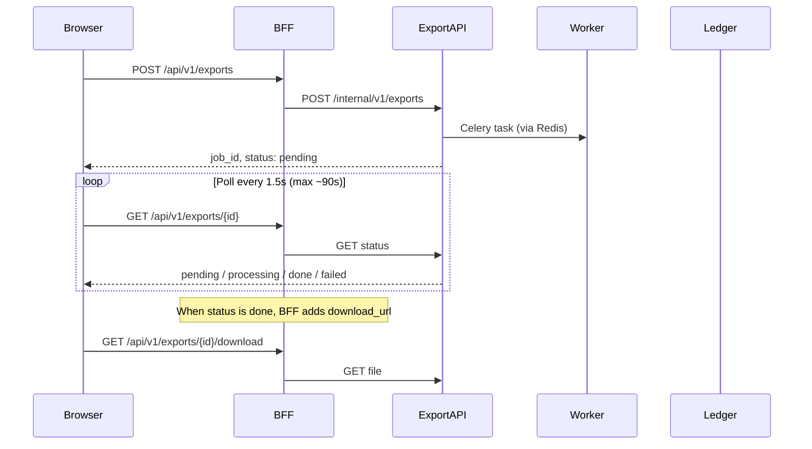

# Architecture

Spend Ledger is a monorepo with four backend services, a Vue SPA, and nginx as the single entry point.

## System overview



| Component | Role |
|-----------|------|
| **nginx** | Routes `/` to the frontend and `/api/` to the BFF |
| **frontend** | Vue 3 SPA (Vite) |
| **bff** | Public API, JWT validation, httpOnly refresh cookies, proxy to internal services |
| **auth-service** | Registration, login, JWT access/refresh tokens, token verification |
| **ledger-service** | Categories, tags, expenses, monthly reports |
| **export-api** | Export job API (creates jobs, returns status) |
| **export-worker** | Celery worker: reads ledger data, writes CSV/XLSX files |

Internal services are not published on the host in the default compose setup. Access goes through nginx on port 80 (or 443 with TLS certs in `infra/certs`).

## Bounded contexts

Each domain service owns its data and exposes an internal HTTP API. Cross-service communication uses HTTP and a shared `user_id` (UUID), not shared database tables.

| Service | Owns | Does not access |
|---------|------|-----------------|
| auth | Users, passwords, refresh tokens | Ledger or export data |
| ledger | Categories, tags, expenses, reports | Auth credentials |
| export | Job state, generated files | Business rules beyond reading ledger |

The BFF is intentionally thin: no domain logic, only auth, routing, and header injection.

## Request routing

nginx (`infra/nginx/nginx.conf`):

- `GET /health` — nginx liveness (plain `ok`)
- `/api/*` — proxied to BFF
- `/*` — proxied to frontend (Vite in dev, static build in prod)

The nginx Docker image (`infra/docker/nginx.Dockerfile`) removes the stock `default.conf` from `nginx:alpine` so it cannot shadow the app proxy on port 80.

BFF public API lives under `/api/v1/*`. OpenAPI contracts are in `contracts/`:

| Contract | Scope |
|----------|-------|
| `bff-v1.yaml` | Public routes exposed to the browser |
| `auth-v1.yaml` | Internal auth routes (`/internal/v1/auth/*`) |
| `ledger-v1.yaml` | Internal ledger routes (`/internal/v1/*`) |
| `export-v1.yaml` | Internal export routes (`/internal/v1/exports/*`) |

Contract validation (`scripts/validate_contracts.py`) compares each service's FastAPI OpenAPI export against its contract file.

## Authentication flow



**Access token** — short-lived JWT (`type: access`), sent by the frontend in the `Authorization` header.

**Refresh token** — stored in an httpOnly cookie (`refresh_token`, path `/api/v1/auth`). The BFF sets it on login/refresh and clears it on logout. In non-development environments the cookie is `Secure`.

**Protected routes** — BFF `AuthMiddleware` requires a valid Bearer token for:

- `/api/v1/categories`, `/tags`, `/expenses`, `/reports`, `/exports`

Auth routes (`/api/v1/auth/*`) are handled separately: login/register are public; `/me` checks the Bearer header in the route handler.

**User isolation** — after JWT validation, the BFF forwards `X-User-Id` to ledger and export. Those services reject requests without this header.

**Frontend retry** — `frontend/src/api/client.js` retries once on 401 by calling `/api/v1/auth/refresh`, then replays the original request.

## Export flow



Job lifecycle: `pending` → `processing` → `done` | `failed`.

The worker paginates through the ledger internal API, writes CSV or XLSX to a shared volume (`export-files`), and updates job status in Redis.

Requires the `export` compose profile (Redis, export-api, export-worker). `make dev` enables it by default.

The export-worker healthcheck uses Celery `inspect ping`. Flower (task monitor) is available at http://127.0.0.1:5555 when the export profile is active.

## Docker Compose profiles

| Profile | Services | Used by |
|---------|----------|---------|
| *(default)* | nginx, bff, auth, ledger, postgres ×2 | Always |
| `dev` | frontend-dev (Vite with HMR) | `make dev` |
| `prod` | frontend (production build) | `make up` |
| `export` | redis, export-api, export-worker, flower | `make dev`, `make up` |
| `integration` | postgres-integration, postgres-auth-integration | `make test` (ledger/auth integration) |

In dev, `frontend-dev` registers a network alias `frontend` so nginx can reach Vite without config changes.

## Health and readiness

| Endpoint | Service | Checks |
|----------|---------|--------|
| `/health` | All Python services | Process is up |
| `/ready` | auth, ledger, export, bff | DB connection (where applicable); BFF also pings downstream `/ready` |

Compose healthchecks use `/ready`. The BFF `/ready` fails with `503 service_unavailable` if auth, ledger, or (when `EXPORT_ENABLED=true`) export is down.

## Shared backend library

Cross-service Python code lives in `packages/spend-ledger-common/` (`spend_ledger_common`):

| Module | Purpose |
|--------|---------|
| `logging.py` | structlog JSON setup with `merge_contextvars` |
| `session.py` | `get_session()`, `session_scope()` via ContextVar |
| `database.py` | `create_async_db_engine()`, `create_session_factory()` |
| `middleware.py` | `@app.middleware("http")` registrars: request ID, request log, DB session |
| `deps.py` | `make_get_user_id()` factory for `X-User-Id` |

Middleware is registered with factory functions (`register_request_id_middleware(app, service_name="…")`) instead of `BaseHTTPMiddleware` subclasses. Registration order matches the previous stack: outermost middleware registered last (e.g. auth: log → request ID → DB session).

**Request ID flow:** middleware binds `request_id` and `service` into structlog contextvars, stores ID on `request.state.request_id`, echoes it in the `X-Request-Id` response header. BFF proxy forwards `request.state.request_id` to downstream services. Export Celery tasks receive `request_id` and bind it in the worker process.

## SQL profiling and N+1 (ledger)

Expense list/detail use `joinedload(Expense.category)` + `selectinload(Expense.tags)` — O(1) SQL vs page size, not N+1.

When `PROFILE_REQUESTS=true`, ledger attaches a SQL counter (`sql_counter.py`) and `SqlProfileMiddleware` logs `sql_queries` per request; warns above 10 queries. Integration test `test_list_expenses_sql_query_count_bounded` asserts ≤ 4 queries for a list page.

## Stack

| Layer | Technology |
|-------|------------|
| Language | Python 3.12 |
| Backend framework | FastAPI, Pydantic v2, uvicorn |
| Package manager | uv (shared root `.venv`) |
| ORM / migrations | SQLAlchemy 2.0 async, Alembic |
| Auth | argon2 (pwdlib), PyJWT |
| Task queue | Celery + Redis |
| Logging | structlog |
| Lint / format | Ruff |
| Frontend | Vue 3, Vite, Pinia, Vue Router, Tailwind CSS 4 |
| HTTP client (browser) | ofetch |
| Tests | pytest, Vitest, Playwright |
| Infra | Docker Compose, nginx, PostgreSQL 16 |

## API errors

All services return errors in a unified JSON shape:

```json
{
  "detail": "Human-readable message",
  "code": "machine_readable_snake_case"
}
```

Validation errors (422) may include an `errors` array with Pydantic field details.

The BFF normalizes upstream error bodies in `app/clients/proxy.py` so clients always receive `detail` and `code`.

### Error codes by service

| Code | HTTP | Service | When |
|------|------|---------|------|
| `missing_bearer_token` | 401 | auth, bff | No `Authorization: Bearer` header |
| `missing_refresh_token` | 401 | bff | Refresh cookie absent on `/auth/refresh` |
| `invalid_token` | 401 | auth, bff | Expired or malformed JWT / refresh token |
| `invalid_credentials` | 401 | auth | Wrong email or password |
| `unauthorized` | 401 | auth | Generic auth failure |
| `missing_user_id` | 401 | ledger, export | Internal call without `X-User-Id` |
| `user_not_found` | 404 | auth | User does not exist |
| `category_not_found` | 404 | ledger | Category missing |
| `tag_not_found` | 404 | ledger | Tag missing |
| `expense_not_found` | 404 | ledger | Expense missing |
| `export_not_found` | 404 | export | Export job missing |
| `email_already_exists` | 409 | auth | Duplicate registration |
| `category_in_use` | 409 | ledger | Delete category with linked expenses |
| `category_duplicate_name` | 409 | ledger | Duplicate category name |
| `tag_duplicate_name` | 409 | ledger | Duplicate tag name |
| `validation_error` | 422 | all | Request body or query validation failed |
| `invalid_upstream_response` | 502 | bff | Malformed response from an internal service |
| `service_unavailable` | 503 | bff | Downstream `/ready` check failed |

Default codes for unmapped HTTP statuses (via BFF proxy fallback): `bad_request`, `forbidden`, `not_found`, `conflict`, `internal_error`, `bad_gateway`, `service_unavailable`.

## Repository layout

```
spend-ledger/
├── contracts/           OpenAPI contracts (versioned)
├── docs/                Architecture and development guides
├── frontend/            Vue SPA
├── infra/
│   ├── docker/          Shared Dockerfiles
│   ├── nginx/           Reverse proxy config
│   └── certs/           TLS certificates (optional)
├── packages/
│   └── spend-ledger-common/  Shared Python library (session, middleware, logging)
├── scripts/             Contract validation, dev cert generation
├── services/
│   ├── bff/             Public API gateway
│   ├── auth/            Authentication
│   ├── ledger/          Expenses, categories, tags, reports
│   └── export/          Background export jobs
├── docker-compose.yml
├── Makefile
├── pyproject.toml       Root dev environment
└── .env.example
```

Each service follows the same internal layout: `app/` with feature modules (router, service, schemas), `app/core/` for config, middleware, exceptions, and `tests/` for pytest.
